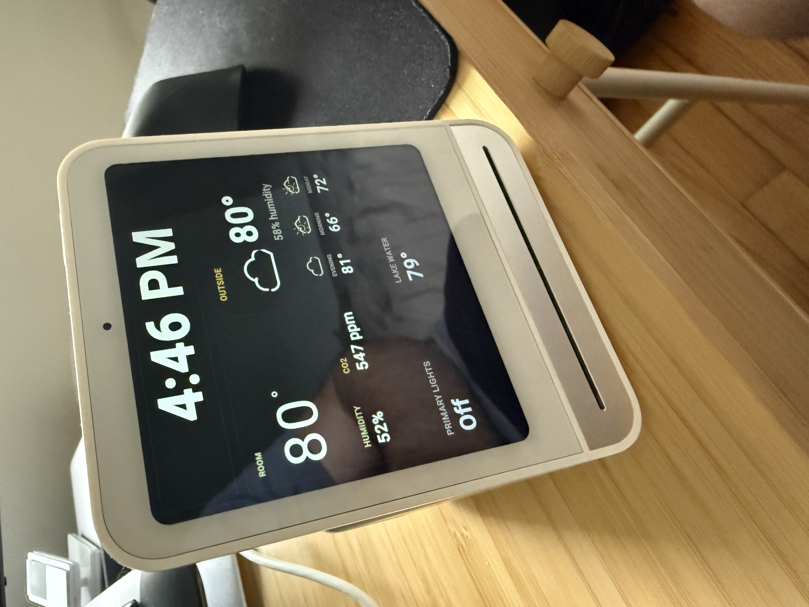

# Qingping Air Monitor 2 Custom Dash



Run a custom Home Assistant dashboard directly on a Qingping Air Monitor 2 /
CGS2-style display using the device's built-in Qt/EGLFS stack.

This repository documents a working approach for replacing the stock Qingping
screen with a lightweight local QML dashboard while keeping the background
reporting process alive.

## What This Is

The Qingping Air Monitor 2 is not an Android tablet. On the device tested here,
it is a small Buildroot Linux system with:

- BusyBox init
- Qt 5 / QML
- EGLFS display output
- `qmlscene`
- `curl`
- `jq`
- SSH/root access
- a stock app named `QingSnow2App`
- a vendor watchdog script named `watchdog.sh`
- a background Miio/MQTT client named `miio_client`

The useful discovery is that you do not need Chromium, WPE, or a browser kiosk
to build a practical dashboard. A small QML app running through EGLFS is stable,
fast enough for glanceable data, and can read local JSON generated by a shell
updater.

## Credits

This work builds on the public device research and declouding notes from:

- https://github.com/ea/cgs2_decloud

That project showed the practical init.d customization path for this device
family, including using custom `/etc/init.d/S??*` scripts and stopping the
stock app/watchdog loop.

## Architecture

The stable pattern is:

1. Let the stock boot sequence initialize hardware, Wi-Fi, sensors, and Miio.
2. Start a late init.d script after the stock launcher.
3. Stop the stock UI/watchdog processes.
4. Suppress `miio_client` and its helper if you want the device to survive WAN
   egress blocking. On the tested unit, `miio_client` scheduled Wi-Fi station
   shutdown when Xiaomi/Mijia cloud connectivity failed.
5. Run `QingSnow2App -platform offscreen`. This is critical: killing Snow
   entirely stops the device's sensor data publishing path, including Qingping's
   own data flow and the MQTT data used by Home Assistant.
6. Run a shell updater that fetches Home Assistant state and writes local JSON.
7. Run `qmlscene -platform eglfs` with a local QML dashboard.
8. Let the QML read only local files, such as:
   - `/userdata/qt-kiosk/state.json`
   - `/userdata/qt-kiosk/garden-latest.jpg`

Avoid making QML do HTTPS/API work directly. It can work briefly, but local
JSON polling is far more robust on this hardware.

## Repository Layout

```text
examples/
  home-assistant/
    qingping-mqtt-poll.yaml
  ha-config.example.json
  ha-json-updater.sh
  init.d/
    S99qt-kiosk
  qml/
    Dashboard.qml
    WeatherGlyph.qml
  qt-kiosk-supervisor.sh
docs/
  device-notes.md
```

## Device Paths Used By The Examples

The examples assume this layout on the Qingping:

```text
/userdata/qt-kiosk/
  ha-config.json
  ha-json-updater.sh
  qt-kiosk-supervisor.sh
  state.json
  Dashboard.qml
  WeatherGlyph.qml
```

And this init script:

```text
/etc/init.d/S99qt-kiosk
```

Important: on the tested firmware, files under `/userdata` may come back as
non-executable after reboot. The init script and supervisor therefore invoke
scripts with `/bin/sh` instead of relying on executable bits.

## Minimal Install Outline

1. Get SSH/root access to the device.
2. Copy files:

```sh
mkdir -p /userdata/qt-kiosk
cp ha-config.json /userdata/qt-kiosk/ha-config.json
cp ha-json-updater.sh /userdata/qt-kiosk/ha-json-updater.sh
cp qt-kiosk-supervisor.sh /userdata/qt-kiosk/qt-kiosk-supervisor.sh
cp qml/Dashboard.qml /userdata/qt-kiosk/Dashboard.qml
cp qml/WeatherGlyph.qml /userdata/qt-kiosk/WeatherGlyph.qml
cp init.d/S99qt-kiosk /etc/init.d/S99qt-kiosk
chmod 755 /etc/init.d/S99qt-kiosk
```

3. Edit `/userdata/qt-kiosk/ha-config.json` for your Home Assistant URL,
   token, and entity IDs.
4. Start manually:

```sh
/etc/init.d/S99qt-kiosk start
```

5. Reboot and verify:

```sh
reboot
```

After the device returns:

```sh
ps -o pid,ppid,stat,comm,args | grep -E "qt-kiosk|qmlscene|ha-json|QingSnow|watchdog|miio" | grep -v grep
```

Expected:

- `miio_client`, `miio_client_helper_nomqtt.sh`, and `miio_recv_line` are not running if you are using the local-only/WAN-blocked pattern.
- `QingSnow2App -platform offscreen` is running so sensor data continues to publish.
- `watchdog.sh` is not running.
- no visible/non-offscreen `QingSnow2App` is running.
- `qt-kiosk-supervisor.sh` is running.
- `ha-json-updater.sh` is running.
- `qmlscene -platform eglfs ... Dashboard.qml` is running.

## Ensuring Sensor Data Continues To Publish

This part is not optional if you still want live sensor data. On the tested
device, killing `QingSnow2App` entirely stopped data publishing, including
Qingping's own data path and the MQTT updates consumed by Home Assistant.
`miio_client` remained running, but it was not enough to make sensor data
available.

For local-only operation, the tested device worked better with `miio_client`
suppressed after boot. When WAN egress was blocked, `miio_client` logged
`sta will close in ...` and eventually tore down Wi-Fi, which also broke SSH and
local MQTT. Snow offscreen continued publishing third-party MQTT without
`miio_client`, though Miio/Xiaomi cloud features were no longer available.

The working compromise is to keep Snow running without letting it own the
display:

```sh
QT_QPA_PLATFORM=offscreen /qingping/bin/QingSnow2App -platform offscreen
```

Keeping Snow alive in offscreen mode preserves the publisher, but reporting
after reboot may still need a report request on the device's MQTT down topic.

### WAN-Blocked / Local-Only Notes

For a fully local setup, there are two separate cloud paths to consider:

- `miio_client` tries to maintain Xiaomi/Mijia cloud connectivity and can tear
  down Wi-Fi when that fails. Suppressing `miio_client` avoided the LAN drop on
  the tested unit.
- `QingSnow2App` still performs its own network checks and vendor service calls
  while running offscreen. Snow is still required for local sensor publishing,
  so do not kill it if you need MQTT data.

On the tested device, Snow's settings in `/data/etc/setting.ini` contained both
`[third]` MQTT settings and a vendor `[host]` MQTT endpoint. Rewriting both to a
local broker kept Snow's MQTT sockets on LAN:

```ini
[host]
host=LOCAL_MQTT_BROKER
port=1883
tls=0
username=YOUR_LOCAL_USERNAME
password=YOUR_LOCAL_PASSWORD

[third]
host=LOCAL_MQTT_BROKER
port=1883
tls=0
username=YOUR_LOCAL_USERNAME
password=YOUR_LOCAL_PASSWORD
```

Snow also runs one-shot Wi-Fi verification commands shaped like
`ping -c 1 TARGET -W 2`. If WAN egress is blocked, allowing outbound ICMP may
help only if every target it probes is permitted. A more deterministic local-only
experiment is to save the original `/bin/ping` as `/bin/ping.real` and install a
targeted wrapper that passes LAN pings through but returns success for Snow's
non-LAN one-shot verifier pings. See:

```text
examples/ping-wrapper.sh
```

This is an invasive change because it replaces a system binary. Keep
`/bin/ping.real` so you can roll back quickly.

The topic pattern is configured in `/data/etc/setting.ini`:

```ini
[third]
pub_topic=qingping/DEVICE_MAC/up
sub_topic=qingping/DEVICE_MAC/down
```

Publishing this payload to `qingping/DEVICE_MAC/down` caused Snow to immediately
publish current sensor data to `qingping/DEVICE_MAC/up`:

```json
{"type":"12","up_itvl":"15","duration":"21600"}
```

In the tested setup, `up_itvl` is the reporting interval in seconds and
`duration` is the requested reporting window in seconds. The included Home
Assistant package example publishes the request on HA start and every five
minutes:

```text
examples/home-assistant/qingping-mqtt-poll.yaml
```

This kept HA online during a 10 minute monitor, with MQTT updates arriving at
the requested 15 second cadence.

## What The Example Dashboard Shows

The sample QML dashboard is intentionally simple:

- local clock
- room temperature
- humidity
- CO2
- outside temperature
- outside humidity
- lake/water temperature
- light state
- three weather forecast slots
- optional latest garden/camera snapshot

It is meant to be edited for your own entities and visual design.

## Optional Camera Snapshot Mode

The updater can also fetch a JSON camera snapshot API and download the newest
JPEG to local storage. The QML can then alternate between dashboard and image.

This is useful when the source image is too heavy or awkward for the panel to
load as a web page. The image display uses a centered crop: fit to display
height, preserve aspect ratio, and center horizontally.

## Optional SSH Hardening

If you leave SSH enabled, switch the device to public-key-only login after you
have confirmed that key-based login works. The tested firmware uses Dropbear, and
the practical hardening point is disabling password authentication for root.

Before changing Dropbear, install your public key and verify key login from a
second terminal:

```sh
mkdir -p /root/.ssh
chmod 700 /root /root/.ssh
cat >> /root/.ssh/authorized_keys
chmod 600 /root/.ssh/authorized_keys
```

Then test from your computer:

```sh
ssh -o BatchMode=yes \
  -o PubkeyAcceptedAlgorithms=+ssh-rsa \
  -o HostkeyAlgorithms=+ssh-rsa \
  -o PreferredAuthentications=publickey \
  -o PasswordAuthentication=no \
  root@DEVICE_IP 'echo publickey_login_ok'
```

Only after that succeeds, persist Dropbear options:

```sh
cat >/etc/default/dropbear <<'EOF'
# Public-key auth only, with fewer auth attempts.
DROPBEAR_ARGS="-s -T 3"
EOF
```

Restart Dropbear or reboot the device, then confirm it came back with the
expected arguments:

```sh
ps -o pid,ppid,stat,comm,args | grep dropbear | grep -v grep
```

Expected process arguments include:

```text
/usr/sbin/dropbear -s -T 3 -R
```

The `-s` flag disables password logins. Do not do this until you know your
public key works, or you can lock yourself out unless you have serial or another
recovery path.

## Notes And Warnings

- This is not a polished product. It is a practical field guide and starter kit.
- You are modifying boot behavior on an embedded device.
- Keep a way back in via SSH or serial before experimenting.
- Do not kill `miio_client` if you still want Miio/Xiaomi cloud support. Do
  suppress it if you are intentionally building a local-only dashboard and
  blocking WAN egress.
- Do not kill `QingSnow2App` entirely if you still want sensor data available
  anywhere; run it with `-platform offscreen` instead, then publish the report
  request on the down topic to start/refresh polling.
- Do not commit Home Assistant tokens or private URLs.
- The examples are based on one tested firmware. Paths/process names may vary.
